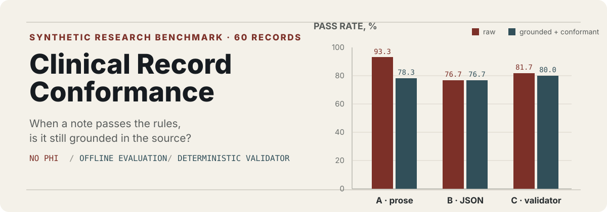
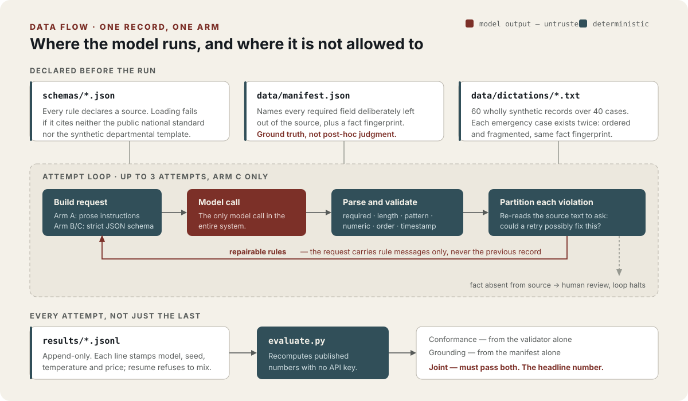

<p align="center">
  
</p>

<p align="center"><strong>English</strong> · <a href="./README.zh-CN.md">中文</a></p>

This public, synthetic-data reconstruction asks a narrow question: what should a clinical-documentation constraint layer optimize? In the committed run, prompt-only free-text generation had the highest raw conformance at 93.3%, but it populated 10 of 12 fields deliberately absent from the source; Arm C reported the gaps instead of silently completing them.

Raw conformance alone is therefore the wrong headline. On `conformant_and_grounded`—passing every rule without filling a controlled omission—the ranking reverses: C reaches 80.0% and A falls to 78.3%. Arm C retries recovered 3 of 3 model extraction or formatting failures and 0 of 11 source-information absences, so the validator's useful role is routing: model errors go back to the model, missing facts go to a human.

The paired input-shape experiment was a null result. Reordering and interrupting otherwise identical facts did not consistently reduce conformance; Arm C was 70% for both narrative and fragmented inputs on the joint metric, and 100% for both across the 14 complete-source pairs. The full C pipeline cost 1.9× as much as A, although most of that gap was already present in template-only B and the three retrying records added 5.1% over B.

| Arm | Method | **Conformant and grounded** | Raw conformance | Source-grounded records | Required-field population | Unsupported fills | Cost |
|---|---|---:|---:|---:|---:|---:|---:|
| A | Prose standard, free-text output | **78.3%** | 93.3% | 83.3% | 100.0% | **10 / 12** | $0.1958 |
| B | Strict JSON template, one attempt | **76.7%** | 76.7% | 98.3% | 98.3% | **1 / 12** | $0.3525 |
| C | JSON template plus source-aware validator loop | **80.0%** | 81.7% | 98.3% | 98.3% | **1 / 12** | $0.3704 |

<p align="center">
  
</p>

Grounding here is deliberately limited to manifest-controlled omissions, not every factual claim. See the [full report](results/report.md) for results and failure analysis, [methodology](docs/methodology.md) for provenance, corpus design, metric definitions, retry policy, and log-integrity details, and [design decisions](docs/decisions.md) for why the pipeline is shaped this way and what each choice cost.

## Run it

This is an offline batch experiment, not a service. The committed report can be reproduced without an API key.

```bash
python3 -m venv .venv
.venv/bin/python -m pip install -r requirements.txt
.venv/bin/python -m pytest -q
.venv/bin/python -m src.evaluate results/final_run.jsonl --report results/report.md
```

To generate a new model run:

```bash
cp .env.example .env  # then set OPENAI_API_KEY
.venv/bin/python -m src.generate
```

## Scope

This is an evaluation artifact, not a clinical product. It has no user interface, agent framework, vector database, EHR integration, deployment configuration, protected health information, private source code, or hospital template. The production system that motivated this reconstruction used Qwen2.5-7B; the public benchmark uses `gpt-4o-2024-08-06` to avoid requiring reviewers to provision local 7B inference, and it evaluates constraint-layer behavior rather than claiming model equivalence. The synthetic rules and results must not be used for clinical, compliance, or documentation decisions.
